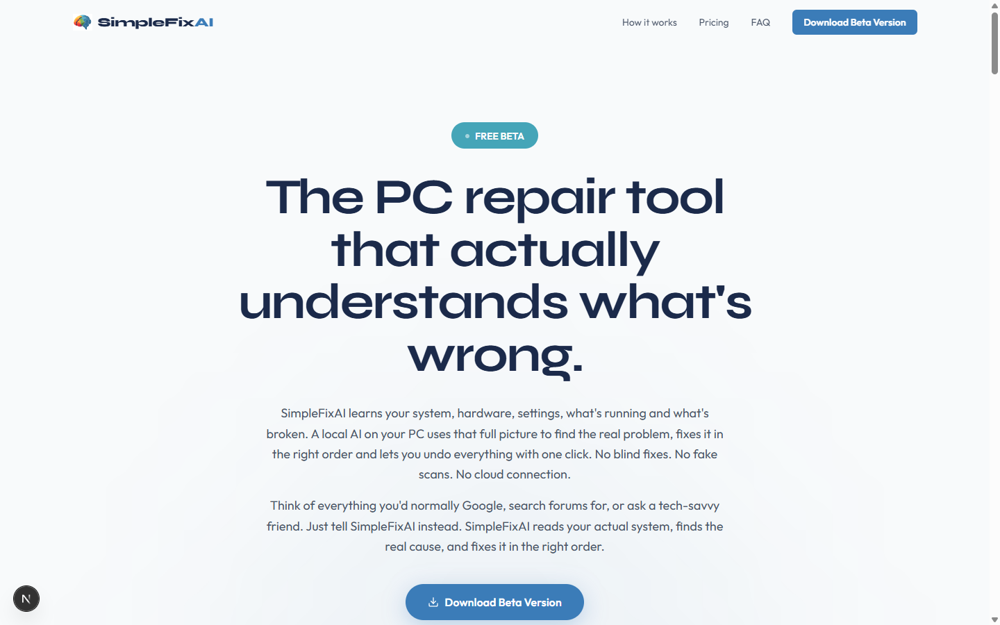
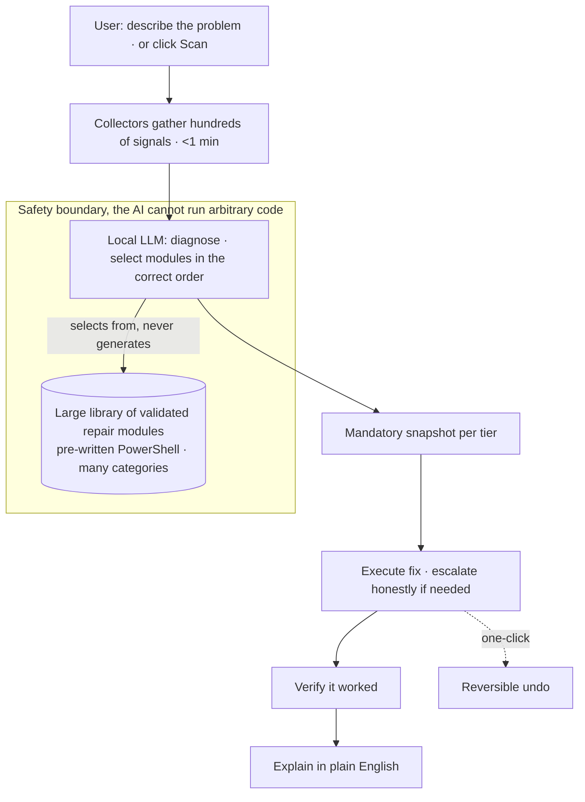

# SimpleFix AI™

> AI-powered Windows repair that diagnoses the problem, applies the right fixes in the right order, explains every step in plain English, and makes every change reversible. Fully offline.

**Live:** [simplefixai.com](https://simplefixai.com)  ·  **Source is private by design**: this repo is a public showcase of the product and its architecture.

## Demo
<video src="https://github.com/SFX-TECH/simplefixai-showcase/raw/main/assets/demo.mp4" poster="https://github.com/SFX-TECH/simplefixai-showcase/raw/main/assets/demo-poster.jpg" controls muted loop width="720"></video>

*Player not loading on your device? [Watch the demo](https://github.com/SFX-TECH/simplefixai-showcase/blob/main/assets/demo.mp4).*

---

## The problem
There are ~1.4 billion Windows PCs in use. When one breaks, people either paste terminal commands they don't understand or install legacy "cleaner" utilities that run static, decade-old scripts: they can't reason about the actual problem, can't explain what they're doing, and can't undo it when they make things worse. The whole category trades on hope.

## What it does
Windows already ships with the tools to repair itself. SimpleFix AI is the reasoning layer that was missing.

> **In plain terms:** A local AI model runs on your own computer, with no internet needed, and works out what is wrong. Before it changes anything it saves a restore point, so you can put things back the way they were.

1. **Describe it or scan it**: type "my wifi isn't working," or hit Scan.
2. **Diagnose**: collectors gather hundreds of system signals in well under a minute.
3. **Plan the fix**: a local AI model selects the right repair modules and sequences them in a safe, dependency-aware order.
4. **Snapshot, then fix**: a mandatory restore point is created before anything changes.
5. **Verify + explain**: it confirms the fix worked and tells you, in plain English, what it did.
6. **Undo anything**: one click rolls the change back.

A **multi-tier repair engine** tries the safest fix first and escalates only if symptoms persist, each tier with its own snapshot. A background **watchdog** can monitor the machine and auto-resolve safe issues behind strict safety gates.

## Honest by design
SimpleFix AI reports **partial results** honestly instead of faking success, and when a problem is genuinely beyond what it can safely fix (for example, a Windows framework-binary corruption whose real remedy is an in-place upgrade), **it tells you and routes you to the correct fix** rather than running tiers that can't reach it. It makes **no cure-rate claim it cannot measure**. For a tool that touches people's machines, trustworthiness is the product.

## The idea that makes it safe (and patent-pending)

> **In plain terms:** The AI is not allowed to type its own commands. It can only pick from a set of pre-approved, tested fixes, so a bad instruction or a model mistake cannot harm your computer.

The AI **never writes or runs raw commands.** It can only choose from an **extensive library of pre-written, safety-bounded, reversible repair modules**, and it must explain each step before it executes. The model decides *what* to do; a bounded layer controls *how*. A prompt-injection attempt or a model mistake therefore **cannot** damage the machine. This AI diagnostic-orchestration method is covered by a **provisional patent**.

## How it's built

> **In plain terms:** The diagram shows the steps from your request to a verified fix. The AI stays inside a safety boundary, where it can choose a repair but cannot run code of its own.

## Tech

> **In plain terms:** This is the list of building blocks the app is made from. The AI model runs on your machine, so repairs work with no internet connection.

| Layer | Stack |
|---|---|
| Desktop shell | Tauri 2 + React 19 + Vite (~10 MB installer) |
| Diagnostic engine | Python 3.11 (WMI, subprocess), shipped as a PyInstaller sidecar, no Python required for users |
| Fix scripts | PowerShell 5.1 (ships with every Windows, zero deps) |
| AI | Local GGUF model via llama.cpp, RAM-aware tiers, fully offline |
| State | SQLite WAL (snapshots, reports, watchdog) |
| Cloud | Supabase + Cloudflare Workers + R2 (telemetry + releases only; not required to repair) |
| CI/CD | GitHub Actions → signed Tauri build |

## By the numbers
- An **extensive library** of repair modules across many categories
- **Thousands** of automated tests, plus a dedicated AI conversation eval harness and a UI test suite
- multi-tier repair engine with honest, snapshot-per-tier escalation
- background watchdog that auto-resolves safe issues behind safety gates
- **RAM-aware** local AI model tiers · **100% offline**
- **~10 MB** installer · per-user install, no admin required
- snapshot before every fix · one-click undo

## Status
**v1.7.5, shipping.** Live at **[simplefixai.com](https://simplefixai.com)**. Built: multi-tier diagnostic + repair engine, local-AI diagnosis with rule-based fallback, natural-language chat, snapshot/undo, background watchdog, reporting (incl. PDF), technician mode, installer-integrity verification, telemetry + conversion-funnel pipeline, and a signed CI/CD release pipeline.

---

Built by **Jesse Jolly** · [SFX Tech Innovation](https://sfxtechinnovation.com) · [LinkedIn](https://linkedin.com/in/jessegjolly)

*Source code is private and proprietary. This repository showcases the product and its architecture only.*
*SimpleFix AI™ is a trademark of SFX Tech Innovation LLC.*
